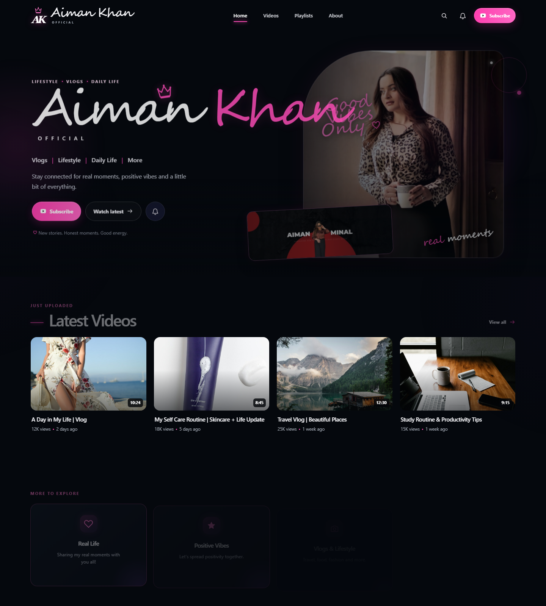
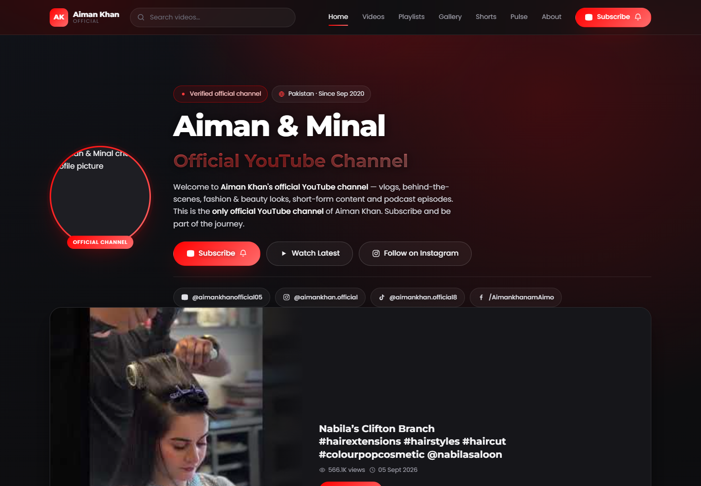
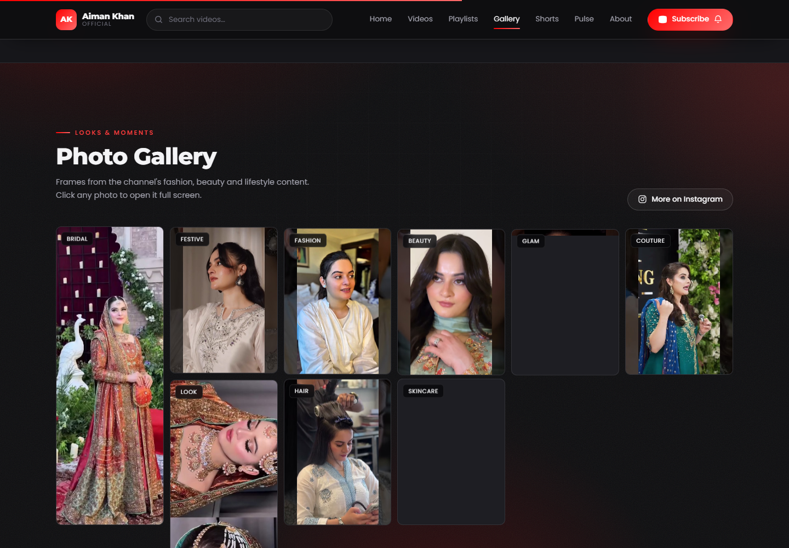
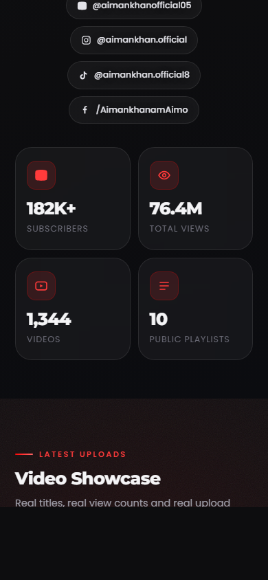
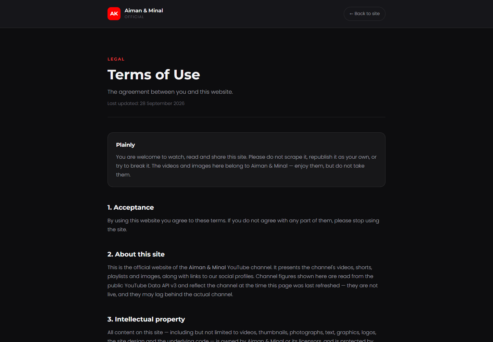

# Aiman Khan Official

A modern personal-brand landing page for Aiman Khan Official featuring a dark luxury aesthetic, video showcase, social content sections, and policy pages.



## Website Screenshots

<div align="center">
  
  
  
  
</div>

## Overview

This project is a static website designed for a digital creator and lifestyle brand. It includes:

- Hero section with brand identity and call-to-action buttons
- Video gallery cards with thumbnails and metadata
- Social and lifestyle feature blocks
- About, privacy, and terms pages
- Responsive dark-mode layout
- JavaScript-powered content and video data handling

## Tech Stack

- HTML
- CSS
- JavaScript
- Node.js static serving

## Project Structure

```text
.
├── assets/                 # UI assets, images, and media
├── js/                    # JavaScript logic for app behavior
├── scripts/               # Content generation and verification scripts
├── shots/                 # Shot/rendering assets and HTML templates
├── ads.txt                # Ads configuration
├── aiman-khan-official.html
├── index.html             # Main homepage
├── privacy.html           # Privacy policy page
├── styles.css             # Main stylesheet
├── terms.html             # Terms page
├── package.json           # npm scripts
├── update-preview.png     # Project preview image
└── README.md
```

## Run Locally

```bash
npm install
npm start
```

Then open:

```text
http://localhost:8899
```

## Scripts

- `npm start` — serves the website locally
- `npm run seed` — generates or seeds video data
- `npm run verify` — verifies project data and setup

## Files of Interest

- `index.html` — homepage layout
- `styles.css` — visual design and responsive styling
- `js/app.js` — site frontend behavior
- `js/config.js` — configuration values and metadata
- `js/seed-videos.js` — seed/video data setup
- `scripts/verify.cjs` — validation logic for generated content

## Notes

The project is structured as a static personal website and is intended to be hosted on a static web host such as GitHub Pages, Netlify, or Vercel.

## License

This project is for personal/brand showcase use. If you plan to reuse or publish it publicly, please confirm your rights to all media and branding assets before deployment.
